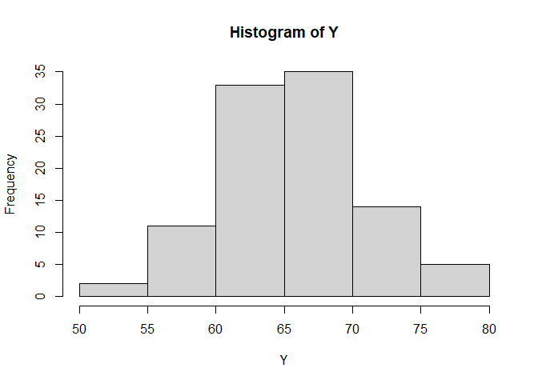

Short Example of Implementing Bayesian Inference in Stan
================

## Set-up

``` r
#setwd("https://github.com/davidrmoxley/inference") # set working directory
library(rstan)
```

## Generate data

Set sample to 100 individuals with heights normally distributed with a
mean of 66 inches and standard deviation of 6 inches.

``` r
N <- 100
Y <- rnorm(N, 66, 6)
```

Histogram shows they’re normally distributed.


## Create a model in Stan

Stan models are comprised of at least three parts:

1)  data block

2)  parameter block

3)  model block

They can be written within separate file

``` r
m_stan <- 'data{
  int N;
  real Y[N]; // continuous variable Y for N individuals, ie array of heights
}
parameters{
  real mu; // continous unconstrained variable
  real<lower=0> sigma; // nonegative value
}
model{
  
  // likelihood
  for(i in 1:N)
    Y[i] ~ normal(mu,sigma); // individual i height, Yi is distributed normal with mean mu and sd sigma
  
  // priors
  mu ~ normal(68, 8);
  sigma ~ cauchy(0,1); // location parameter 0, scale parameter 1; effectively half cauchy bc sigma is nonegative
}'
```

## Fitting the model

Introducing parallelism will improve performance. Each chain can only be
run on one core.

``` r
cores <- parallel::detectCores() # determine the number of cores
cores
```

    ## [1] 8

``` r
options(mc.cores = cores-2) # set parallel
```

Here, we have 8 cores available and decided to use 6. We’ll run 6
chains, one per core.

> Note: we could run multiple chains per core. It is advisable to run at
> least 4 chains to increases chances of convergence.

In executing the model, you define the model codes, and map the data
variables in your R environment to those defined in the Stan
code.

``` r
m_fit <- rstan::stan(model_code = m_stan, data = list(N=N, Y=Y), iter=500, chains=(cores-2))
```

## Interpreting

``` r
print(m_fit)
```

    ## Inference for Stan model: d54149082e5ec3f30b24d98bd83dc290.
    ## 6 chains, each with iter=500; warmup=250; thin=1; 
    ## post-warmup draws per chain=250, total post-warmup draws=1500.
    ## 
    ##          mean se_mean   sd    2.5%     25%     50%     75%   97.5% n_eff Rhat
    ## mu      65.56    0.02 0.56   64.35   65.19   65.59   65.94   66.61   961    1
    ## sigma    5.55    0.01 0.40    4.78    5.28    5.53    5.80    6.40  1212    1
    ## lp__  -223.26    0.04 1.10 -226.30 -223.58 -222.94 -222.52 -222.26   641    1
    ## 
    ## Samples were drawn using NUTS(diag_e) at Mon Jan 04 13:15:24 2021.
    ## For each parameter, n_eff is a crude measure of effective sample size,
    ## and Rhat is the potential scale reduction factor on split chains (at 
    ## convergence, Rhat=1).
